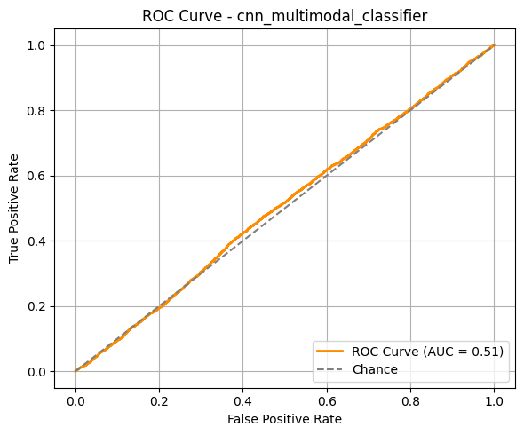

### Disclaimer ⚠️
This tool is being developed primarily for educational purposes: to explore how to build tools like this and to create a pharma-oriented coding portfolio. It stands on the project developed at Le Wagon Data Science bootcamp by Alice Lemery, Jean-Baptiste Fallacher, Benjamin Galet PhD and Laura Ossorio Carballo PhD. While we strive for scientific accuracy, any conclusions drawn from its results should not be considered definitive or used as the sole basis for decision-making.

That said, if you run or collaborate with a wet lab specializing in immuno-oncology and are interested in validating this tool through experiments, we’d love to hear from you! Feel free to reach out, we're always open to meaningful collaborations.

# 🛡️ ImmunoReady
Deep Learning for Immune Readiness & Personalized Cancer Vaccine Design

## 🧬 What is ImmunoReady?
ImmunoReady is a deep learning tool trained with a comprehensive immunological dataset to predict whether a MHC class I peptide can trigger an immune response.
It is being developed with the intention of detecting single amino acid changes in immunopeptides, a critical capability for assessing the potential effectiveness of personalized vaccines based on point mutations.

🧠 AI-Powered
🔬 Mutation-Sensitive
💉 Cancer Vaccine-Oriented

## 🎯 Key Features
🧠 Deep Learning Model trained on curated immunological data

🎯 Point Mutation Sensitivity to detect single-residue impact on immunogenicity (under development)

🧪 MHC Class I Focus for CD8+ T-cell epitope prediction

🧬 Personalized Vaccine Design Support

📊 Immunogenicity Scoring and interpretability tools

⚡ Fast Inference with minimal input

# 🧪 Training and Evaluation Data Specifications

## 📥 Training Data

### ▶️ Peptides from the HLA Ligand Atlas
This dataset provides peptides naturally presented by MHC molecules in healthy human tissues. These peptides are assumed to induce immune tolerance, as their presence in normal cells suggests they do not trigger an immune response.

Purpose: Serve as the non-immunogenic class (tolerated peptides).

Data source: Downloaded on June 29, 2025 from:
🔗 https://hla-ligand-atlas.org/data

### ▶️ Peptides from IEDB
These peptides are experimentally validated to trigger positive T cell responses and bind to MHC Class I and II molecules.

Purpose: Serve as the immunogenic class (immune-activating peptides).

Filtering: Cancer-derived epitopes are excluded to avoid bias and ensure that no cancer peptides appear in the training set.

## 🛠 Training Set Preparation and Sample Weighting
The training dataset is built by merging non-immunogenic peptides from the HLA Ligand Atlas and immunogenic peptides from IEDB (excluding cancer-derived sequences). After cleaning and combining the datasets, categorical features such as MHC Restriction Class and MHC status are one-hot encoded, and peptide sequences are embedded using the tokeniser of choice. For each peptide entry, a raw weight is calculated as the averaged number of individuals in which the peptide was observed. To prevent extreme differences in loss contribution, these weights are scaled to a fixed range using MinMaxScaler and applied during model training. The processed feature matrices, target labels, and scaled weights are stored as .joblib files for fast reuse. The pipeline also includes a reproducible train/validation split, ensuring that embeddings, categorical features, targets, and weights remain aligned across both sets.

## 🧪 Evaluation (Test) Set

### ▶️ Cancer-Derived Peptides from IEDB
Peptides in the evaluation set are derived from cancer tissues, as annotated in the IEDB database. These were explicitly excluded from the training data to serve as an independent test set.

Purpose: Evaluate generalization and assess biological bias. The model must predict immunogenicity in cancer peptides without having seen any during training.

Origin: Human peptides (like training), but specific to cancer contexts.

                +--------------------------+
                |     Total Peptide Data   |
                +--------------------------+
                          |
        +----------------+------------------+
        |                                   |
    +----------------+               +-------------------------+
    |   Training Set  |              |     Evaluation Set      |
    +----------------+               +-------------------------+
    |                |               |                         |
    |  HLA Ligand    |               |  Cancer-derived peptides|
    |  Atlas         |               |  from IEDB (excluded    |
    |  (non-immun.)  |               |  from training)         |
    |                |               |                         |
    |  IEDB          |               +-------------------------+
    |  (immunogenic, |
    |   non-cancer)  |
    +----------------+

⚠️The API request is WIP, still not functional at the moment (https://github.com/IEDB/IQ-API-use-cases)

# ⚙️ Feature Engineering
## MHC I and II Shared Epitope:
For MHC class II-presented peptides, we extract the embedded MHC class I-length epitope (typically 8–11 amino acids) that is contained within the longer class II sequence. This feature captures shared immunogenic motifs that may be presented by both MHC I and II pathways, potentially enhancing the model’s ability to learn cross-presentation signals.

# 📦 Trained Models

| Model Name                    | Type        | Description |
|-------------------------------|-------------|-------------|
| `cnn_multimodal_classifier`   | CNN         | A multimodal CNN for binary immunogenicity prediction combining 2D peptide feature maps with categorical metadata via parallel branches and late fusion. Trained on positive IEDB (excluding peptides from cancer as previously stated) and HLA-ligand atlas normal peptides. Tested on cancer-derived peptides. |

## 🎯 Performance Metrics

#### Model: `cnn_multimodal_classifier`
- 🔍 Precision: 0.32 (How many predicted positives are actually correct).
🎯 Recall: 0.63 (How many actual positives were correctly identified).
✅ Accuracy: 0.46 (Overall proportion of correct predictions).
⚖️ F1 Score: 0.43 (Harmonic mean of precision and recall; balances both).
📈 ROC AUC: 0.51 Probability the model ranks a random positive above a random negative.

## Git commit labels

Labels to include at the beginning of commit messages for improved traceability.

- feat:	New feature
- fix:	Bug fix
- dev: development in progress
- docs:	Documentation only
- test:	Adding or updating tests

# Acnowledgement of published work on the matter:

We stand on the shoulders of giants. This job is based on previous published science.

Li et al., 2021 – DeepImmuno: Deep learning-empowered prediction and generation of immunogenic peptides for T-cell immunity
👉 https://www.ncbi.nlm.nih.gov/pmc/articles/PMC7781330/

Wu et al., 2019 – DeepHLApan: A deep learning approach for neoantigen prediction considering both HLA-peptide binding and immunogenicity
👉 https://pubmed.ncbi.nlm.nih.gov/31736974/

Sidhom et al., 2018 – Deep learning for class I and class II HLA binding prediction (AI-MHC)
👉 https://pubmed.ncbi.nlm.nih.gov/33398286/

Diao et al., 2023 – Seq2Neo-CNN: Predicting immunogenicity of tumor neoantigens using convolutional neural networks
👉 https://www.ncbi.nlm.nih.gov/pmc/articles/PMC11581883/

Wang et al., 2023 – INeo-Epp: An ensemble learning framework for predicting immunogenic epitopes
👉 https://www.ncbi.nlm.nih.gov/pmc/articles/PMC11581883/

Li et al., 2024 – ProVaccine: Predicting immunogenic antigens using dual-attention neural networks
👉 https://arxiv.org/abs/2410.02647

Yu et al., 2024 – UnifyImmun: Cross-attention deep learning for joint prediction of peptide-HLA and peptide-TCR interactions
👉 https://arxiv.org/abs/2405.06653

Ma et al., 2025 – Triad sequence fusion model for predicting peptide–MHC–TCR binding and immunogenicity
👉 https://arxiv.org/abs/2501.01768

Goffinet et al., 2023 – MATE-Pred: A multimodal attention-based predictor of TCR–epitope binding affinity
👉 https://arxiv.org/abs/2401.08619
